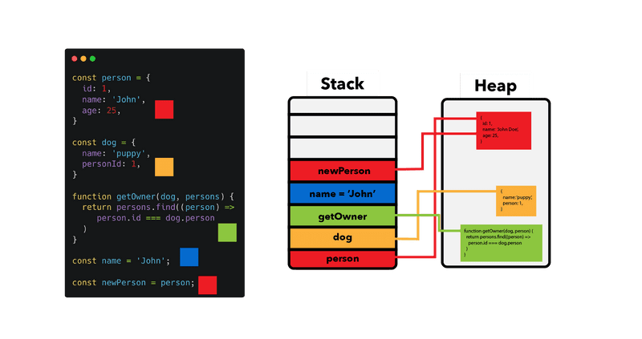
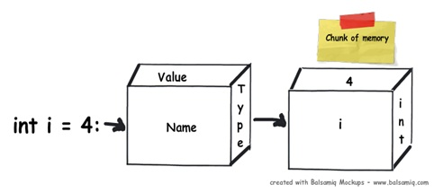

## Stack and Heap :

> https://www.codeproject.com/Articles/76153/Six-important-NET-concepts-Stack-heap-value-types#Stack%20and%20Heap

> https://www.udemy.com/course/datastructurescncpp

> https://stackoverflow.com/questions/79923/what-and-where-are-the-stack-and-heap.

> https://felixgerschau.com/javascript-memory-management/

Memory in a program can either be allocated on a stack or a heap.

When we declare a variable in an application, it allocates some chunk of memory in the RAM. This memory has three things: the name of the variable, the data type of the variable, and the value of the variable.

<div align="center">
    
</div>

Memory allocation and de-allocation is done using LIFO (Last In First Out) logic.

```
Method1()
{
    // Line 1
    int i=4;

    // Line 2
    int y=2;

    //Line 3
    class1 cls1 = new class1();
}
```

- Line 1: When this line is executed, the compiler allocates a small amount of memory in the stack. The stack is responsible for keeping track of the running memory needed in your application.

- Line 2: Now the execution moves to the next step. As the name says stack, it stacks this memory allocation on top of the first memory allocation. You can think about stack as a series of compartments or boxes put on top of each other.

- Line 3: In line 3, we have created an object. When this line is executed, it creates a pointer on the stack and the actual object is stored in a different type of memory location called ‘Heap’. ‘Heap’ does not track running memory, it’s just a pile of objects which can be reached at any moment of time. Heap is used for dynamic memory allocation.

<div align="center">
    
</div>

why two types of memory ?
primitive data types are not complex, they hold single values like ‘int i = 0’. Object data types are complex, they reference other objects or other primitive data types.
Object types need dynamic memory while primitive ones needs static type memory.

<div align="center">
    
</div>
