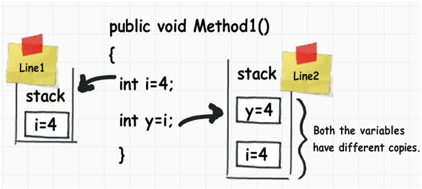
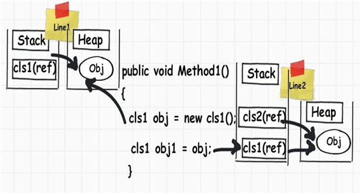

## Value Types and Reference Types :

> https://www.codeproject.com/Articles/76153/Six-important-NET-concepts-Stack-heap-value-types#Stack%20and%20Heap

- Value types are types which hold both data and memory on the same location. When we assign the int value to the other int value, it creates a completely different copy. In other words, if you change either of them, the other does not change. These kinds of data types are called as ‘Value types’.

    

- A reference type has a pointer which points to the memory location.When we create an object and when we assign an object to another object, they both point to the same memory location as shown in the below code snippet. So when we assign obj to obj1, they both point to the same memory location.

In other words, if we change one of them, the other object is also affected; this is termed as ‘Reference types’.

    

