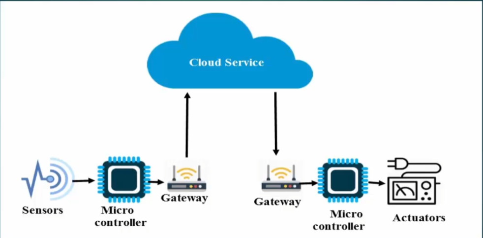

1. <strong>Who generates Data ?</strong>

- sensors : A sensor is a device that detects and responds to some type of input from the physical environment.

2. <strong>Who collect data from sensors ?</strong>

- Micro controller : a small computer

3. <strong>who store data for global access?</strong>

- cloud : remote database

4. <strong>who sends data to cloud ?</strong>

- micro controller (doesn't have internet conn) >> gateway device : acts as a gate who connect two networks that uses diff protocols : GPRS, Wifi

    

