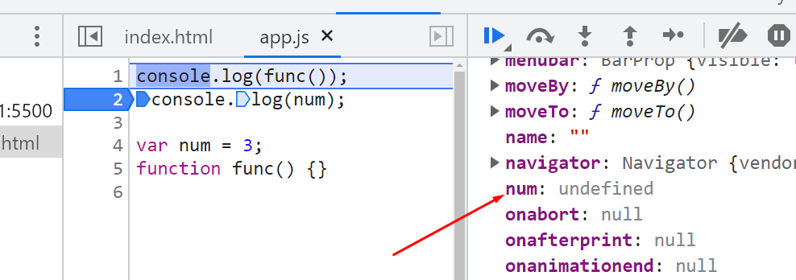

# Most famous myth about Hoisting : "Javascript moves the variables on the top"

> https://youtu.be/qikxEIxsXco

1. Creation Phase : Compiler runs through the entire code for 2 time before actually executing the code,

- In the first run, It picks all function declarations and stores them in memory with their reference.

<div align="center">
    
</div>

- In the second run, It picks all variables and assign undefined to them. In the event of a conflict between variable and function declaration name then that variable is ignored.

<div align="center">
    
</div>

2. Execution Phase

- Variables assigned with values
- Functions executed

```
console.log(func());
console.log(num);
console.log(func2());

var num = 3;
function func() {
  return "from func()";
}
var func2 = function () {};

```

<div align="center">
    
</div>

- line-1 : picks all function declarations and stores them in memory with their reference.

- line-2 : when memory is allocated to variables it store undefined

- line-3 : we are storing function inside a variable, and when memory is allocated to variables it store undefined, so when we try to invoke the variable as a function, js finds undefined instead of a function, so it shows error that getName() is not a function as that is actually a normal variable that you're are trying to access as a function

# Hoisting is the phenomenon in JS by which we can access variables and functions even before we have initialised it. We can access them without any error. Incase of function it's pretty clear that - Function declarations are scanned and are made available. But in case of my variable during memory creation phase it will be assigned undefined value.


- Hosting works for all var, let and const. It's just variables defined by let and const are in temporal deadzone which cann't be accessible hence we get error. Else all three(var,let,const) are hoisted.

- why var doesn't go to the temporal dead zone ?
var doesn't go to temporal dead zone because it goes to global scope 
Also temporal dead zone is a just a term
let and const are block scope