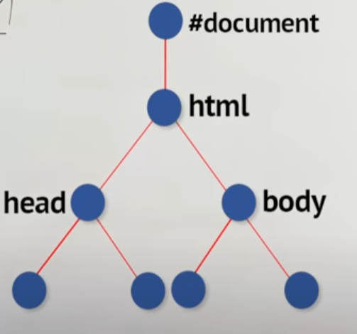

### Virtual dom is something which react maintains inside the memory of javascript and the real dom which appears on the page that means any sort of change which we do to dom right here reflects directly on the page however this virtual dom is a fast javascript in memory representation of almost all the elements you see in the dom right and react does that why the reason react does it is because it's easier to manipulate and do batch updates and do all sorts of stuff in javascript than actually just individually shipping every single change to the real dom because that is slow.

## Real Dom:

```
<html lang="en">
  <head>
        .....
  </head>
  <body>
        ....
  </body>
</html>
```

<div align="center">
    
</div>

## Virtual Dom:

```
const [elements, setElements] = useState([1, 2, 3]);
  return (
    <ul>
      {elements.map((element) => (
        <li key={element}>{element}</li>
      ))}
    </ul>
  );
```

Here these li has their own text node information, let's consider these keys

<div align="center">
    
</div>

Let's update the elements to [4,5,3]

Now what react has to do?
react has to go to the ul and say that hey you have new children now and once react tries to update this it also has to inform dom right that render this on the screen because this is in js right this is in js like we mentioned here and this has to convey this to dom but what you will see here because you have given unique keys the new children are four five and three right so this means react can actually say that only these two elements (4,5) have updated and this element(3) is still the same why because it knows that this element has not been updated because its key has not been changed because its key was three
now because of this react only has to dispatch two updates to dom that means it only has to update two lis on the screen that means the browser has to
only work on updating the contents of these two allies if you did not have a key attribute here react has no idea which element should it preserve or which element should it destroy right so

<div align="center">
    
</div>

if we don't have keys react would destroy all these three allies it will destroy all these three allies and reconstruct all of them which is potentially i mean it's the same effect in this small example but if you think about an example where you have hundreds of item on the screen or something which renders in thousands like a table list certain elements then this becomes a huge performance boost.

for same reason if element has same key, react can not distinguish the elements
